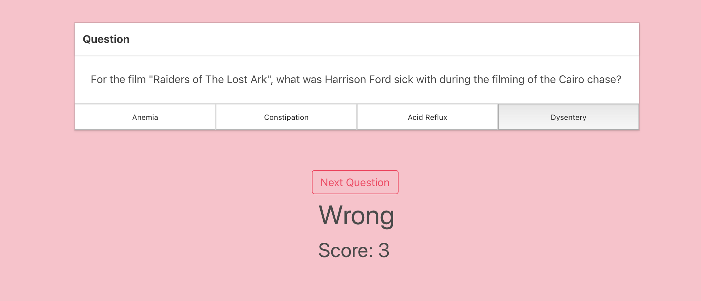
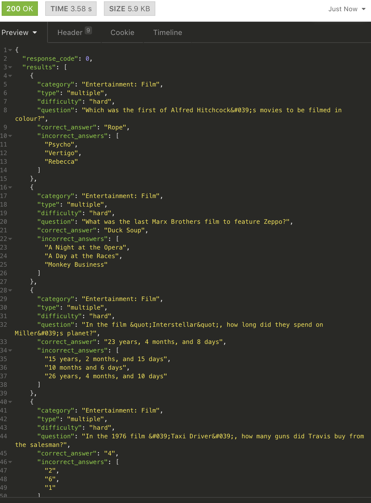

# SEI - Project 2 Front End Application Movie Quiz
## Overview

This project was to work in a pair to **build a React application** that consumed a **public API**, this project was also known as a Reactathon. This project was made in collaboration with Amy Wilson (github.com/amydaniellewilson).

Click to view the live version of the app --->
**[Movie Quiz](https://moviequiz.herokuapp.com/)**

### Technical Requirements

* Consume a public API – this could be anything but it must make sense for your project.
* Have several components - At least one classical and one functional.
* The app can include a router - with several "pages".
* Be deployed online and accessible to the public.


---

### Technologies used

* JavaScript (ES6) / HTML5 / CSS
* React.js (Framework)
* Consumes the OpenTDB via the HTTP client Axios
* Git
* gitHub
* Bulma


### Timeframe

1 1/2 days

---

## The Approach

Once the API had been chosen we read the documentation in how to receive the data. There are 2 levels for the quiz "easy" and "hard, we decided that we would focus on just retrieving the data for easy, and once that was accomplished then to move onto the hard levels. Each GET request returned 50 questions per each difficulty level therefore we chose to make the quiz out of 10 so there wont be much repetition for frequent users of the quiz. The documentation for the API https://opentdb.com/api_config.php

---

## User Journey


Opens with the home page asking the user to start the Quiz


Next the user is asked what difficulty level they would like to do the quiz in. The options are either easy or hard

```
  playEasy() {
    this.setState({ gameMode: 'easy' }, () => this.getData())
  }

  playHard() {
    this.setState({ gameMode: 'medium' }, () => this.getData())
  }
  ```


When playing the game the question will appear on the screen with 4 possible answers at the bottom. The user makes a decision on which answer they think is right and if they are correct their score either increases or stays the same.

```
getData() {
  axios.get(`https://opentdb.com/api.php?amount=50&category=11&type=multiple&difficulty=${this.state.gameMode}`)
    .then(res => this.setState({ quiz: res.data.results }, () => this.random()))
    .catch(err => console.log(err))
}
```
The API request has an array with 50 movies viewed and tested in insomnia below:


We had to create a function so the correct answer was not always first - as this seemed to happen after getting each question. The function below allowed the correct answer to be randomised between the selection of 4 choices.

```
random() {
  const questions = this.state.quiz
  const currentQuestion = questions[Math.floor(Math.random() * questions.length)]
  const answers = this.shuffle([...currentQuestion.incorrect_answers, currentQuestion.correct_answer])
  this.setState({ currentQuestion, answers })
}
```

Finally after 10 questions you will reach the result page where you will see the score, here the user will also have the option to play the game again.


---

## Wins
To finish the project within one and a half days was a complete win as we succeeded in completing the task with a functioning working app.

## Challenges

We noticed that even though the quiz was out of 10 questions that occasionally some questions would appear twice. Therefore we created the below function to randomised the questions from the array taken from the API, and made it so each question is never used again.

```
shuffle(array) {
  let currentIndex = array.length, temporaryValue, randomIndex
  while (0 !== currentIndex) {

    randomIndex = Math.floor(Math.random() * currentIndex)
    currentIndex -= 1

    temporaryValue = array[currentIndex]
    array[currentIndex] = array[randomIndex]
    array[randomIndex] = temporaryValue
  }
  return array
}
```


---

## Future Developments

For future developments I would like to create a new CSS setting for the quiz. I would also like to make it a multi-purpose quiz using a second API, and third API perhaps in music and history. 
